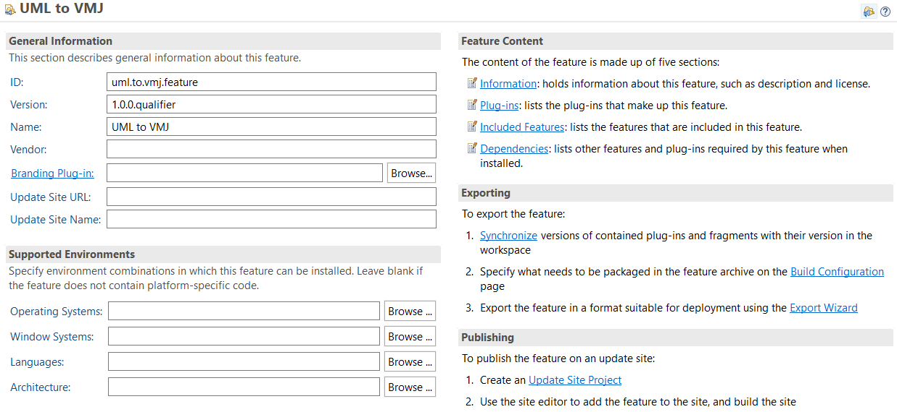

# PricesIDE Update Site

Update site for all PricesIDE plugins. So far it host these plugins:
- [WinVMJ Composer](https://gitlab.com/RSE-Lab-Fasilkom-UI/PricesIDE/winvmj-composer)
- [WinVMJ Composer Dependencies for FeatureIDE 3.8.1 or older](https://github.com/spectrum71/FeatureIDE/tree/UVL-usage)
- [UML to VMJ](https://gitlab.com/RSE-Lab-Fasilkom-UI/PricesIDE/uml-to-vmj)
- [IFML UI Generator](https://gitlab.com/RSE-Lab-Fasilkom-UI/PricesIDE/ifml-ui-generator)
- IFML DOP Editor
## Installing plugin with update site.
Before installing the plugin, **be sure to fulfil each plugin's prequisites first**.
1. On top toolbar, click on `Help`>`Install New Software`.
2. Type PricesIDE update site (https://amanah.cs.ui.ac.id/priceside/updatesite/) on `Work with` textbox.
3. Install required plugins.

## Updating Plugin on Update Site

When adding or modifiying the plugins in update site, you need to rebuild and update it on Amanah server. To accomplish this, you need to complete the following steps.
1. Download all plguins' repository and it feature project. **Be sure to fulfil each plugin's prequisites first**. If for some reason you can't do that, install all the plugins and then create a new feature project for each plugin.

Make sure it matches the configuration of the original feature project, or at least put a representative descriptions. You can configure the descriptions as pictured above.
2. Reassemble the content by adding feature projects to update site. There are categories that points out where you need to put the feature projects. You can also edit the feature projects to configure which plugin should be included on that feature.
  - For FeatureIDE plugins: make sure there is a plugin project.
  - For Acceleo plugins: in addition to plugin project, **make sure there is a UI plugin project as well (incicated in `.ui` suffix)**.
3. Click `build all`.
4. Go to Amanah Server and clear all contents in `/var/www/priceside/updatesite'.
5. Put the generated artifacts there.

You can then update the plugin using the updated update site.